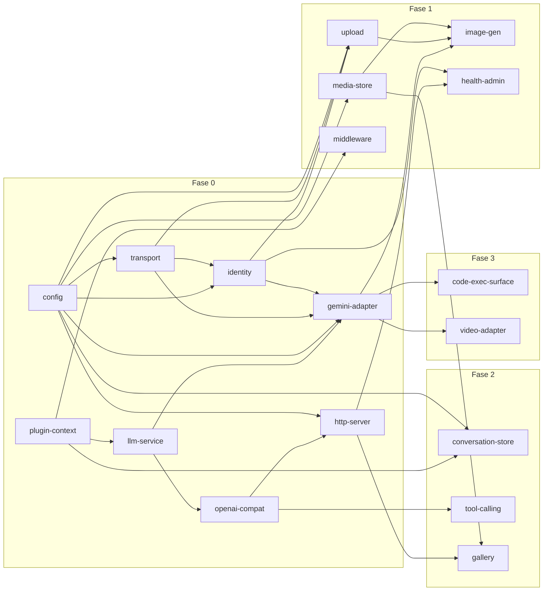

# SPEC.md — Gemini Bridge

**Project:** `gemini-bridge`  
**Document Version:** 1.0 (Root Specification)  
**Date:** 2026-09-30  
**Status:** Draft for Review & Approval  
**Owner:** Afi  
**License:** MIT  

---

## 1. Objective

`gemini-bridge` is a self-hosted, highly efficient server written in **Rust** that bridges client applications to **Gemini Web** (`gemini.google.com`) through an **OpenAI-compatible REST API**.

Client applications can configure their `base_url` to point at `gemini-bridge` and immediately utilize Gemini Web's capabilities — including chat completion (streaming and non-streaming), **image generation**, multimodal reference uploads, persistent conversations, tool calling emulation, and structured code execution / citation extraction — without managing browser automation or paying official API fees.

The core architecture follows the **"everything is a plugin"** philosophy (inspired by `deepseek-harness` and `Cordis`), ensuring capabilities are swappable, adaptive, and reversible.

### 1.1 Target Personas
- **P0 — Client Application Developer (Afi & team):** Integrates AI capabilities using standard OpenAI-compatible SDKs without dealing with upstream wire protocol specifics, cookie rotation, or `batchexecute` mechanisms.
- **P1 — Self-host Power User:** Runs the bridge on a local machine or VPS with a single Google account; requires operational observability (session status, credential rotation, logs, health checks).
- **P2 — Non-cloud / Offline-first Application:** Desktop or edge applications running the bridge locally side-by-side.

---

## 2. Capability Map & Module Architecture

Per `agent-skills:spec-driven-development` preparation, the system is decomposed into 18 modular capabilities with explicit dependency boundaries. Each module corresponds to a dedicated crate in the Cargo workspace and has its own child specification document (`docs/specs/SPEC-<module-id>.md`). Module IDs identify crate directories; the Cargo package names are listed separately in the table and may differ (for example, `gemini-adapter` → `gemini-bridge-adapter-gemini`).

### 2.1 Capability Map Table

| Module ID | Crate Name | Responsibility | Depends On | Phase |
|---|---|---|---|---|
| `plugin-context` | `gemini-bridge-plugin-context` | DI container, typed event bus (`emit`, `waterfall`, `serial`, `parallel`, `bail`), plugin registry, lifecycle disposers | — | Fase 0 |
| `config` | `gemini-bridge-config` | TOML parsing (`bridge.toml`), profile overlay (`dev`, `prod`, `lowmem`), environment variable overrides | — | Fase 0 |
| `transport` | `gemini-bridge-transport` | HTTP client with TLS/JA3 fingerprint impersonation (Chrome/Firefox), proxy support (HTTP/SOCKS5), retry policy | `config` | Fase 0 |
| `identity` | `gemini-bridge-identity` | Session bootstrap (`/app`), extraction of `bl`, `SNlM0e`, `f.sid`, automatic `__Secure-1PSIDTS` rotation, cookie storage (0600 mode, optional at-rest encryption via `BRIDGE_SECRET`) | `transport`, `config` | Fase 0 |
| `gemini-adapter` | `gemini-bridge-adapter-gemini` | Upstream wire protocol: `f.req` positional serialization, `StreamGenerate` client, newline-framed response parsing, prefix-diff engine, externalized `schema/gemini-web.toml` index map | `llm-service`, `identity`, `transport`, `config` | Fase 0 |
| `llm-service` | `gemini-bridge-llm-service` | Neutral LLM traits, streaming/non-streaming abstraction, provider-agnostic request/response data structures | `plugin-context` | Fase 0 |
| `openai-compat` | `gemini-bridge-openai-compat` | OpenAI REST API schema mapping (`/v1/chat/completions`, `/v1/models`), request normalization to immutable context objects | `llm-service` | Fase 0 |
| `http-server` | `gemini-bridge-http-server` | Axum 0.8 / Hyper 1.x server, routing, SSE streaming pipelines, CORS, bearer authentication | `openai-compat`, `config` | Fase 0 |
| `media-store` | `gemini-bridge-media-store` | Content-addressed local media storage (SHA-256), filesystem caching, cleanup/TTL, metadata management | `config` | Fase 1 |
| `upload` | `gemini-bridge-upload` | Resumable push uploads to `content-push.googleapis.com`, MIME sniffing, SSRF validation, content-hash deduplication, `fileRef` acquisition | `identity`, `transport`, `config` | Fase 1 |
| `image-gen` | `gemini-bridge-image-gen` | `/v1/images/generations` handler, image URL extraction from response tree, local proxying/caching, format transformation (`url`/`b64_json`) | `gemini-adapter`, `upload`, `media-store` | Fase 1 |
| `health-admin` | `gemini-bridge-health-admin` | `/healthz`, `/readyz`, `/admin/status`, guided `/admin/reauth`, in-memory reload, 405 build label auto-recovery | `http-server`, `identity` | Fase 1 |
| `middleware` | `gemini-bridge-middleware` | Waterfall event middleware: rate limiting, log secret redaction, audit logging, request tracing | `plugin-context` | Fase 1 |
| `conversation-store` | `gemini-bridge-conversation-store` | SQLite metadata persistence (`rusqlite`), upstream IDs (`conversationId`, `responseId`, `candidateId`), conversation branching and regeneration | `plugin-context`, `config` | Fase 2 |
| `tool-calling` | `gemini-bridge-tool-calling` | OpenAI `tools[]` schema injection into prompt, structured JSON output parser, malformed call validator, tool execution feedback loop | `openai-compat` | Fase 2 |
| `gallery` | `gemini-bridge-gallery` | `/gallery` endpoint (JSON) + embedded static HTML UI (`include_str!`), thumbnail generation, media filter/deletion | `media-store`, `http-server` | Fase 2 |
| `code-exec-surface` | `gemini-bridge-code-exec` | Extraction of `code_execution` (stdout/stderr) and grounding citations into non-intrusive `gemini_metadata` response extension | `gemini-adapter` | Fase 3 |
| `video-adapter` | `gemini-bridge-adapter-video` | Experimental video generation adapter (off-by-default, explicit 501 fallback) | `gemini-adapter` | Fase 3 |

### 2.2 Dependency Direction & Build Order



The graph shows the direct dependencies declared in the capability map; runtime composition does not add crate-dependency edges.

---

## 3. Tech Stack

| Layer / Concern | Technology & Crate | Rationale & Constraint |
|---|---|---|
| **Language** | Rust (Edition 2024, stable) | Zero GC pauses, minimal memory footprint, single static binary |
| **Async Runtime** | `tokio 1.x` (multi-threaded) | Industry standard, robust timers, async I/O |
| **HTTP Server** | `axum 0.8` / `hyper 1.x`, `tower`, `tower-http` | Fast, type-safe routing, native SSE (`axum::response::Sse`) |
| **HTTP Client & TLS** | `reqwest` + `rustls` (with JA3 fingerprint support via `boring` / custom TLS config) | Required to prevent upstream Google bot flagging and JA3 fingerprint blocks |
| **Serialization** | `serde`, `serde_json`, `toml` | Robust positional array and nested response parsing |
| **Metadata Storage** | `rusqlite` (bundled SQLite) | Single-file embedded transactional database without external daemon |
| **Media Storage** | Local filesystem (content-addressed SHA-256) | Zero DB bloat, easy backup, minimal memory usage |
| **Configuration** | `figment` or `config` with TOML & environment variable overlay | Layered profiles (`dev`, `prod`, `lowmem`) and 12-factor compliance |
| **Observability** | `tracing`, `tracing-subscriber` (JSON formatter) | Structured logging with `request_id`, secret redaction waterfall |
| **Plugin Architecture** | In-repo static registry, trait objects, manual registration for the initial release | Deterministic boot; the later reload mechanism is not yet selected (see §10) |
| **Testing** | `cargo test`, `cargo nextest`, `wiremock`, `insta` (snapshot testing) | Deterministic mocks, fast runner, regression-resistant wire parser tests |
| **Performance Benchmarking** | `oha`, `wrk` | Verification of p50 ≤ 15ms overhead latency and memory bounds |

---

## 4. Commands

All development and CI operations use standardized Cargo workflows:

```bash
# Workspace Build
cargo build --workspace
cargo build --workspace --release

# Running the Bridge
cargo run --bin gemini-bridge -- --config bridge.toml
cargo run --bin gemini-bridge -- auth login
cargo run --bin gemini-bridge -- doctor

# Testing
cargo test --workspace
cargo nextest run --workspace
cargo test --test integration_suite -- --nocapture

# Snapshot Testing (Insta)
cargo insta test
cargo insta review

# Linting & Formatting Check (Quality Gate - 100% required)
cargo clippy --workspace --all-targets --all-features -- -D warnings
cargo fmt --all -- --check

# Formatting Application
cargo fmt --all

# Dependency & Security Audit
cargo audit
cargo deny check
```

---

## 5. Project Structure

```
gemini-bridge/
├── Cargo.toml                      # Workspace root manifest
├── Cargo.lock
├── RULES.md                        # Strict repository operating rules
├── SPEC.md                         # This document (Root Spec)
├── bridge.example.toml             # Example configuration template
├── schema/
│   └── gemini-web.toml             # Externalized upstream f.req and response index maps
├── crates/
│   ├── plugin-context/             # DI, typed event bus, plugin traits
│   ├── config/                     # TOML & profile configuration loader
│   ├── transport/                  # HTTP client with JA3 impersonation & proxy
│   ├── identity/                   # Session bootstrap, cookie & token management
│   ├── gemini-adapter/             # Wire protocol, f.req serialization, prefix-diff
│   ├── llm-service/                # Generic LLM service abstractions
│   ├── openai-compat/              # OpenAI API request/response models & mapping
│   ├── http-server/                # Axum routing, handlers, SSE streaming
│   ├── media-store/                # Content-addressed media storage & caching
│   ├── upload/                     # Google push upload integration
│   ├── image-gen/                  # Image generation pipeline & extraction
│   ├── health-admin/               # Health checks, ready checks, reauth admin
│   ├── middleware/                 # Waterfall middleware (redact, rate-limit)
│   ├── conversation-store/         # SQLite conversation & branch persistence
│   ├── tool-calling/               # Emulated function/tool calling engine
│   ├── gallery/                    # Gallery endpoints and embedded HTML UI
│   ├── code-exec-surface/          # Code execution stdout & citation extractor
│   └── video-adapter/              # Experimental video generation adapter
├── src/
│   └── main.rs                     # Binary entrypoint, CLI commands, plugin wiring
├── docs/
│   ├── intent/
│   │   └── gemini-bridge.md        # Confirmed intent document
│   └── specs/                      # Per-module child specifications
│       ├── SPEC-plugin-context.md
│       ├── SPEC-config.md
│       ├── SPEC-transport.md
│       ├── SPEC-identity.md
│       ├── SPEC-gemini-adapter.md
│       ├── SPEC-llm-service.md
│       ├── SPEC-openai-compat.md
│       ├── SPEC-http-server.md
│       ├── SPEC-media-store.md
│       ├── SPEC-upload.md
│       ├── SPEC-image-gen.md
│       ├── SPEC-health-admin.md
│       ├── SPEC-middleware.md
│       ├── SPEC-conversation-store.md
│       ├── SPEC-tool-calling.md
│       ├── SPEC-gallery.md
│       ├── SPEC-code-exec-surface.md
│       └── SPEC-video-adapter.md
├── tests/
│   ├── common/                     # Test fixtures, mock servers, helper utilities
│   ├── snapshots/                  # Insta snapshot files for parser validation
│   ├── e2e_chat_test.rs            # Chat completion integration tests
│   ├── e2e_image_test.rs           # Image generation integration tests
│   └── resilience_drills_test.rs   # 405, 429, cookie expiry simulation tests
└── tasks/
    ├── plan.md                     # Phased roadmap & implementation strategy
    └── todo.md                     # Granular task tracker
```

---

## 6. Code Style & Conventions

### 6.1 General Rules
- **Rust Edition 2024:** Use modern idiomatic Rust idioms.
- **Error Handling:** Use `thiserror` for domain-specific library crate errors; use `eyre` or `anyhow` solely in CLI / `main.rs` binary boundaries. Never use `.unwrap()` or `.expect()` in production code paths.
- **Async & Concurrency:** Prefer pure asynchronous streams (`futures::Stream`, `tokio::sync::mpsc`). Avoid holding locks (`tokio::sync::Mutex`) across await points when lock-free or channel-based patterns suffice.
- **Immutability:** Once an incoming OpenAI request is validated and normalized into the internal request context, it is treated as immutable (`ctx.freeze()`). All transformations operate via pure middleware pipes or event waterfall filters.
- **Security by Construction:** Zero credential logging. Passwords, cookies, and tokens must implement `std::fmt::Debug` with masked output (`***REDACTED***`).

### 6.2 Plugin & DI Pattern Example

```rust
use async_trait::async_trait;
use std::sync::Arc;
use thiserror::Error;

#[derive(Debug, Error)]
pub enum PluginError {
    #[error("Dependency missing: {0}")]
    MissingDependency(&'static str),
    #[error("Initialization failed: {0}")]
    InitFailed(String),
}

pub type Disposer = Box<dyn FnOnce() -> Result<(), PluginError> + Send + Sync>;

#[async_trait]
pub trait Plugin: Send + Sync {
    fn id(&self) -> &'static str;
    fn requires(&self) -> Vec<&'static str> { Vec::new() }
    async fn setup(&self, ctx: &mut PluginContext) -> Result<Disposer, PluginError>;
}

/// Service Registration in Context
pub struct PluginContext {
    registry: std::collections::HashMap<&'static str, Arc<dyn std::any::Any + Send + Sync>>,
    event_bus: EventBus,
}

impl PluginContext {
    pub fn provide<T: Send + Sync + 'static>(&mut self, key: &'static str, service: Arc<T>) {
        self.registry.insert(key, service);
    }

    pub fn inject<T: Send + Sync + 'static>(&self, key: &'static str) -> Result<Arc<T>, PluginError> {
        self.registry
            .get(key)
            .and_then(|any| any.clone().downcast::<T>().ok())
            .ok_or(PluginError::MissingDependency(key))
    }
}
```

---

## 7. Testing Strategy

### 7.1 Testing Levels
1. **Unit Tests (`cargo test --lib`):**
   - Pure parser verification: `f.req` construction, newline-delimited stream deserialization, prefix-diff calculator, schema index lookups.
   - SSRF validator: IPv4/IPv6 loopback, link-local, private subnet rejections.
   - Error mapping: Upstream HTTP codes to OpenAI HTTP error representations.

2. **Integration & Snapshot Tests (`tests/`, `insta`):**
   - Mock upstream Gemini responses using `wiremock` to verify end-to-end streaming chunks and termination without network calls.
   - Record and verify upstream response trees against saved snapshots to detect unexpected Google payload structural drifts.

3. **Evaluation & Chaos Suites (Traceable to PRD Section 3.2):**
   - **E1 — Golden Test Suite:**
     - 50 structured chat prompts (reasoning, long text, code, multilingual) verifying complete, untruncated streaming output.
     - 20 image generation prompts (5 with image reference uploads) verifying valid image magic bytes and non-zero dimensions.
     - 10 tool calling cases verifying clean `tool_calls` JSON extraction (target ≥ 95% pass rate).
   - **E2 — Resilience Drills:**
     - Simulated `405 Method Not Allowed / Invalid BL` → Automatic session bootstrap & single silent retry.
     - Simulated `429 Rate Limit` → Exponential backoff + transparent downstream 429 response.
     - Simulated `Cookie Expiry` → Clean state transition to `needs_reauth`, zero crash loops.
   - **E3 — Performance Benchmarks:**
     - `oha` / `wrk` under 100 concurrent connections for 30s.
     - Overhead latency verified: p50 ≤ 15 ms, p95 ≤ 40 ms.
     - Idle RSS memory verified: ≤ 25 MB; active streaming: ≤ 120 MB per 10 active connections.
   - **E4 — Token & Efficiency Audit:**
     - Verification of delta stream prefix diffing to avoid duplicate token transmission.

---

## 8. Boundaries

### 8.1 Always Do
- Enforce **100% pass on formatting, clippy, unit tests, and integration tests** before any merge or milestone completion.
- Redact Google credentials, cookies (`__Secure-1PSID`, `__Secure-1PSIDTS`, `SAPISID`), and request authorization headers from all logs and error traces.
- Verify SSRF restrictions on all image/file URLs before outbound retrieval.
- Restrict disk cache permissions for credentials and database files to mode `0600` (`-rw-------`).
- Maintain strict backward compatibility with OpenAI API v1 specifications for all public endpoints.
- Return explicit `x-gemini-bridge-*` HTTP headers for bridge-specific observability without polluting OpenAI schema fields.

### 8.2 Ask First
- Modifying the public REST API contracts or adding non-standard query parameters.
- Introducing new external crate dependencies outside the approved tech stack.
- Altering database schema definitions in `conversation-store` or cache directory layouts.
- Adjusting default security settings (e.g., exposing non-localhost binds without mandatory API keys).

### 8.3 Never Do
- **Never commit real credentials, cookies, tokens, or live session dumps** into version control.
- **Never implement third-party SaaS multi-tenancy**, user billing, or cross-tenant quota management in this repository.
- **Never silently swallow upstream errors** without structured logging or appropriate mapping to downstream HTTP status codes.
- **Never use `.unwrap()` or panic-inducing constructs** in non-test production code paths.
- **Never make outbound telemetry or phone-home network calls.**

---

## 9. Success Criteria (Measurable KPIs)

| # | Metric / Acceptance Criterion | Target | Verification Method |
|---|---|---|---|
| 1 | **Overhead Latency** added by bridge (excluding upstream network) | **p50 ≤ 15 ms**, p95 ≤ 40 ms | `oha` benchmark measuring internal delta timer (`t_emit - t_upstream_chunk`) |
| 2 | **Idle Memory Footprint** | **≤ 25 MB RSS** | System process monitor (`ps`, `jemalloc` stats) at rest |
| 3 | **Active Streaming Memory** | **≤ 120 MB RSS** per 10 concurrent streams | Stress test with 10 concurrent active long-stream requests |
| 4 | **Cold Start Time** (startup to socket open) | **≤ 150 ms** | Benchmark test measuring process init to `/healthz` response |
| 5 | **Continuous Stream Stability** | **≥ 99% success rate** over 7 days continuous run | Soak testing with automated periodic probe queries |
| 6 | **OpenAI API Parity** for Core Endpoints | **100% pass** on standard test suite for `/v1/chat/completions`, `/v1/images/generations`, `/v1/files` | Integration test suite against OpenAI Python/TS SDK fixtures |
| 7 | **Binary Size** | Single static release binary **≤ 25 MB** | `cargo build --release`, check stripped binary footprint |
| 8 | **Zero-Downtime Session Recovery** | 405 BL expiry recovered silently in **< 2.0s** without dropping active client connections | Chaos test triggering 405 injection during continuous stream |

---

## 10. Resolved Decisions & Project Parameters

For explicit traceability, the following critical decisions were confirmed during the specification review:

1. **Capability Scope:** Approved 18 modules structured across 7 dependency layers.
2. **License:** MIT License.
3. **Session Credentials:** Account policy uses project operator's designated Google account (configured locally/externally; never stored in git).
4. **Plugin Architecture (initial release):** Built-in static registry with trait objects (zero `unsafe` dynamic loading in the initial release). The required Fase 3 reload mechanism remains undecided; see Open Architecture Decisions below.
5. **API Key Security:** Configurable via `bridge.toml` (default: optional on `127.0.0.1`, mandatory on non-localhost bindings and `/admin/*` routes).
6. **Gallery UI:** Embedded lightweight static HTML UI served directly by binary (`include_str!`).
7. **TLS/JA3 Fingerprinting:** Full JA3 impersonation client included in Fase 0 scope; the specific implementation must be validated against Gemini Web before closing Task 0.3.
8. **Media Capabilities:** Video generation included as experimental (Fase 3); Audio/TTS deferred post-v2.0.
9. **At-Rest Encryption:** Optional AES-GCM encryption for stored session tokens when `BRIDGE_SECRET` is supplied (fallback to OS-level `0600` file permissions).
10. **Browser Automation:** Camofox is available in the local development environment for manual cookie extraction/testing, but is NOT a runtime dependency of the deployed binary.
11. **Default Network Binding:** Configurable via `bridge.toml`, default `127.0.0.1:8090`.

### Open Architecture Decisions

These choices are intentionally unresolved and must be settled in the relevant module specification or implementation task; the alternatives below are not commitments:

- **Fase 3 plugin reload:** Choose between replacing built-in plugin instances in-process and loading dynamic libraries (for example, with `libloading`). Preserve active streams either way. No dynamic-library ABI, `unsafe` policy, or implementation is approved yet.
- **TLS/JA3 implementation:** Select and validate a client implementation/profile (the stack currently lists `boring` or custom `rustls` configuration as alternatives) against an actual Gemini Web request in Task 0.3.
- **Configuration crate:** Select `figment` or `config` when specifying the config module.
- **Credential encryption:** Define key derivation and nonce/storage handling for the optional AES-GCM path when specifying the identity module; `BRIDGE_SECRET` alone does not settle those details.
